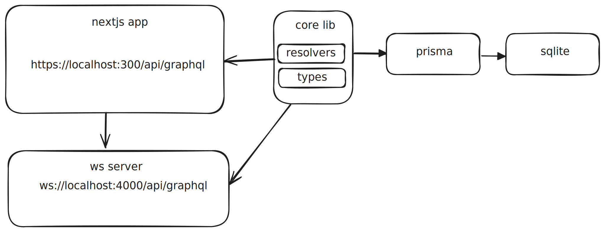
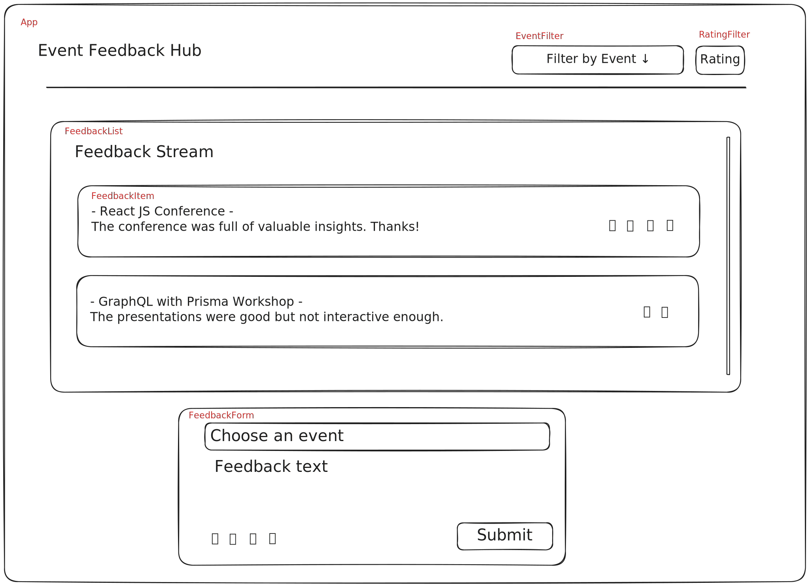

# Event Feedback Hub

##### [📺 Walktrough video](https://www.loom.com/share/75c057ac24024a6a8430414d7859a9c7?sid=ef4318bd-665e-477e-b9ee-936cf7e5255a)

## Development Roadmap

1. **System Architecture Design**
2. **Low-Fidelity Component Prototyping**
3. **API Development**
   1. **Data Schema Modeling**
   2. **GraphQL Resolver Implementation**
4. **WebSocket Server Integration**
5. **Frontend Component Development**
6. **Testing**

### 1. System Architecture Design



### 2. Component Prototype Design



## Technical Specifications

### Technology Stack

- **Frontend Framework:** Next.js
- **Data Management:** Apollo GraphQL
- **Styling:** Tailwind CSS, ShadCN
- **API Layer:** Apollo GraphQL, TypeGraphQL, WebSocket, GraphQL-WS, Yoga-GraphQL (Subscriptions)
- **Database:** SQLite with Prisma ORM

## Project Architecture

This project is structured as a monorepo, managed using Lerna and NPM workspaces, comprising three primary packages:

### efh-app (Next.js Application)

- **src/**: Application source code
  - **components/**: Reusable UI components (from shadcn)
  - **graphql/**: Graphql Queries
  - **lib/**: Utility functions and services
  - **app/**: Core application components and routing
    - **components/**: Application-specific UI components
      - **Event/**: Event-related UI components
      - **Feedback/**: Feedback-related UI components
  - **store.ts**: Zustand state management configuration

### efh-core (Core Library)

- **src/**: Core library source code
  - **graphql.ts**: GraphQL schema and resolver definitions
  - **lib/**: Utility functions and services
  - **pkg/**: Feature-specific modules (e.g., event, feedback, user)

### efh-wss (WebSocket Server)

- **src/index.ts**: WebSocket server implementation

## Development environment setup

Update .env file

```
# App
HTTP_PORT=3000
WS_PORT=4000

NEXT_PUBLIC_HTTP_URL=http://localhost:4000/graphql
NEXT_PUBLIC_WS_URL=ws://localhost:4000/graphql

# DB
DATABASE_URL=file:../../../event-feedback-hub.db

# Auth
GITHUB_CLIENT_ID="Ov23linZMl1VTHspbSOp"
GITHUB_CLIENT_SECRET="b5eb24e77c74eba382bfbaa3fb729da7ebc74784"

# Misc
GUEST_USER_ID=cm0f4earw000011etc05dq1jg
```

Run migrations

```
npm run prisma:migrate
```

Seed databse

```
npm run prisma:seed
```

Build project

```
npm run build
```

Run locally

```
npm run dev
```

Start locally

```
npm start
```

🚀 The app is up and running at [localhost:3000](http://localhost:3000).

# Deplyment

TBD
